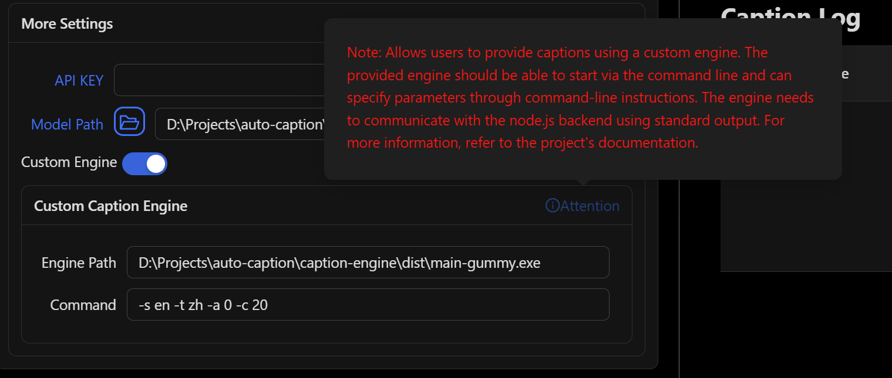

# Auto Caption User Manual

Corresponding Version: v1.1.1

**Note: Due to limited personal resources, the English and Japanese documentation files for this project (except for the README document) will no longer be maintained. The content of this document may not be consistent with the latest version of the project. If you are willing to help with translation, please submit relevant Pull Requests.**

## Software Introduction

Auto Caption is a cross-platform caption display software that can real-time capture system audio input (recording) or output (playback) streaming data and use an audio-to-text model to generate captions for the corresponding audio. The default caption engine provided by the software (using Alibaba Cloud Gummy model) supports recognition and translation in nine languages (Chinese, English, Japanese, Korean, German, French, Russian, Spanish, Italian).

The default caption engine currently has full functionality on Windows, macOS, and Linux platforms. Additional configuration is required to capture system audio output on macOS.

The following operating system versions have been tested and confirmed to work properly. The software cannot guarantee normal operation on untested OS versions.

| OS Version         | Architecture | Audio Input Capture | Audio Output Capture |
| ------------------ | ------------ | ------------------- | -------------------- |
| Windows 11 24H2    | x64          | ✅                   | ✅                    |
| macOS Sequoia 15.5 | arm64        | ✅ Additional config required  | ✅          |
| Ubuntu 24.04.2     | x64          | ✅                   | ✅                    |
| Kali Linux 2022.3  | x64          | ✅                   | ✅                    |
| Kylin Server V10 SP3 | x64 | ✅ | ✅ |


### Software Limitations

To use the Gummy caption engine, you need to obtain an API KEY from Alibaba Cloud.

Additional configuration is required to capture audio output on macOS platform.

The software is built using Electron, so the software size is inevitably large.

## Preparation for Using Gummy Engine

To use the default caption engine provided by the software (Alibaba Cloud Gummy), you need to obtain an API KEY from the Alibaba Cloud Bailian platform. Then add the API KEY to the software settings or configure it in environment variables (only Windows platform supports reading API KEY from environment variables).

**The international version of Alibaba Cloud services does not provide the Gummy model, so non-Chinese users currently cannot use the default caption engine.**

Alibaba Cloud provides detailed tutorials for this part, which can be referenced:

- [Obtaining API KEY (Chinese)](https://help.aliyun.com/zh/model-studio/get-api-key)
- [Configuring API Key through Environment Variables (Chinese)](https://help.aliyun.com/zh/model-studio/configure-api-key-through-environment-variables)


## Preparation for GLM Engine

You need to obtain an API KEY first, refer to: [Quick Start](https://docs.bigmodel.cn/en/guide/start/quick-start).

## Preparation for Using Vosk Engine

To use the Vosk local caption engine, first download your required model from the [Vosk Models](https://alphacephei.com/vosk/models) page. Then extract the downloaded model package locally and add the corresponding model folder path to the software settings.


## Using SOSV Model

The way to use the SOSV model is the same as Vosk. The download address is as follows: https://github.com/HiMeditator/auto-caption/releases/tag/sosv-model

## Capturing System Audio Output on macOS

> Based on the [Setup Multi-Output Device](https://github.com/ExistentialAudio/BlackHole/wiki/Multi-Output-Device) tutorial

The caption engine cannot directly capture system audio output on macOS platform and requires additional driver installation. The current caption engine uses [BlackHole](https://github.com/ExistentialAudio/BlackHole). First open Terminal and execute one of the following commands (recommended to choose the first one):

```bash
brew install blackhole-2ch
brew install blackhole-16ch
brew install blackhole-64ch
```


After installation completes, open `Audio MIDI Setup` (searchable via `cmd + space`). Check if BlackHole appears in the device list - if not, restart your computer.


Once BlackHole is confirmed installed, in the `Audio MIDI Setup` page, click the plus (+) button at bottom left and select "Create Multi-Output Device". Include both BlackHole and your desired audio output destination in the outputs. Finally, set this multi-output device as your default audio output device.


Now the caption engine can capture system audio output and generate captions.

## Getting System Audio Output on Linux

First execute in the terminal:

```bash
pactl list short sources
```

If you see output similar to the following, no additional configuration is needed:

```bash
220     alsa_output.pci-0000_02_02.0.3.analog-stereo.monitor    PipeWire        s16le 2ch 48000Hz       SUSPENDED
221     alsa_input.pci-0000_02_02.0.3.analog-stereo     PipeWire        s16le 2ch 48000Hz       SUSPENDED
```

Otherwise, install `pulseaudio` and `pavucontrol` using the following commands:

```bash
# For Debian/Ubuntu etc.
sudo apt install pulseaudio pavucontrol
# For CentOS etc.
sudo yum install pulseaudio pavucontrol
```

## Software Usage

### Modifying Settings

Caption settings can be divided into three categories: general settings, caption engine settings, and caption style settings. Note that changes to general settings take effect immediately. For the other two categories, after making changes, you need to click the "Apply" option in the upper right corner of the corresponding settings module for the changes to take effect. If you click "Cancel Changes," the current modifications will not be saved and will revert to the previous state.

### Starting and Stopping Captions

After completing all configurations, click the "Start Caption Engine" button on the interface to start the captions. If you need a separate caption display window, click the "Open Caption Window" button to activate the independent caption display window. To pause caption recognition, click the "Stop Caption Engine" button.

### Adjusting the Caption Display Window

The following image shows the caption display window, which displays the latest captions in real-time. The functions of the three buttons in the upper right corner of the window are: to close the caption display window, to open the caption control window, and to enable mouse pass-through. The width of the window can be adjusted by moving the mouse to the left or right edge of the window and dragging the mouse.


### Exporting Caption Records

In the caption control window, you can see the records of all collected captions. Click the "Export Log" button to export the caption records as a JSON or SRT file.

## Caption Engine

The so-called caption engine is essentially a subprogram that captures real-time streaming data from system audio input (recording) or output (playback), and invokes speech-to-text models to generate corresponding captions. The generated captions are converted into JSON-formatted strings and passed to the main program through standard output. The main program reads the caption data, processes it, and displays it in the window.

The software provides two default caption engines. If you need other caption engines, you can invoke them by enabling the custom engine option (other engines need to be specifically developed for this software). The engine path refers to the location of the custom caption engine on your computer, while the engine command represents the runtime parameters of the custom caption engine, which should be configured according to the rules of that particular caption engine.



Note that when using a custom caption engine, all previous caption engine settings will be ineffective, and the configuration of the custom caption engine is entirely done through the engine command.

If you are a developer and want to develop a custom caption engine, please refer to the [Caption Engine Explanation Document](../engine-manual/en.md).

## Using Caption Engine Standalone

### Runtime Parameter Description

> The following content assumes users have some knowledge of running programs via terminal.

The complete set of runtime parameters available for the caption engine is shown below:


However, when used standalone, some parameters may not need to be used or should not be modified.

The following parameter descriptions only include necessary parameters.

#### `-e , --caption_engine`

The caption engine model to select, currently three options are available: `gummy, glm, vosk, sosv`.

The default value is `gummy`.

This applies to all models.

#### `-a, --audio_type`

The audio type to recognize, where `0` represents system audio output and `1` represents microphone audio input.

The default value is `0`.

This applies to all models.

#### `-d, --display_caption`

Whether to display captions in the console, `0` means do not display, `1` means display.

The default value is `0`, but it's recommended to choose `1` when using only the caption engine.

This applies to all models.

#### `-t, --target_language`

> Note that Vosk and SOSV models have poor sentence segmentation, which can make translated content difficult to understand. It's not recommended to use translation with these two models.

Target language for translation. All models support the following translation languages:

- `none` No translation
- `zh` Simplified Chinese
- `en` English
- `ja` Japanese
- `ko` Korean

Additionally, `vosk` and `sosv` models also support the following translations:

- `de` German
- `fr` French
- `ru` Russian
- `es` Spanish
- `it` Italian

The default value is `none`.

This applies to all models.

#### `-s, --source_language`

Source language for recognition. Default value is `auto`, meaning no specific source language.

Specifying the source language can improve recognition accuracy to some extent. You can specify the source language using the language codes above.

This applies to Gummy, GLM and SOSV models.

The Gummy model can use all the languages mentioned above, plus Cantonese (`yue`).

The GLM model supports specifying the following languages: English, Chinese, Japanese, Korean.

The SOSV model supports specifying the following languages: English, Chinese, Japanese, Korean, and Cantonese.

#### `-k, --api_key`

Specify the Alibaba Cloud API KEY required for the `Gummy` model.

Default value is empty.

This only applies to the Gummy model.

#### `-gkey, --glm_api_key`  

Specifies the API KEY required for the `glm` model. The default value is empty.  

#### `-gmodel, --glm_model`  

Specifies the model name to be used for the `glm` model. The default value is `glm-asr-2512`.  

#### `-gurl, --glm_url`  

Specifies the API URL required for the `glm` model. The default value is: `https://open.bigmodel.cn/api/paas/v4/audio/transcriptions`.  

#### `-tm, --translation_model`

Specify the translation method for Vosk and SOSV models. Default is `ollama`.

Supported values are:

- `ollama` Use local Ollama model for translation. Users need to install Ollama software and corresponding models
- `google` Use Google Translate API for translation. No additional configuration needed, but requires network access to Google

This only applies to Vosk and SOSV models.

#### `-omn, --ollama_name`

Specifies the name of the translation model to be used, which can be either a local Ollama model or a cloud model compatible with the OpenAI API. If the Base URL field is not filled in, the local Ollama service will be called by default; otherwise, the API service at the specified address will be invoked via the Python OpenAI library.  

If using an Ollama model, it is recommended to use a model with fewer than 1B parameters, such as `qwen2.5:0.5b` or `qwen3:0.6b`. The corresponding model must be downloaded in Ollama for normal use.  

The default value is empty and applies to models other than Gummy.  

#### `-ourl, --ollama_url`

The base request URL for calling the OpenAI API. If left blank, the local Ollama model on the default port will be called.  

The default value is empty and applies to models other than Gummy.  

#### `-okey, --ollama_api_key`

Specifies the API KEY for calling OpenAI-compatible models.  

The default value is empty and applies to models other than Gummy.  

#### `-vosk, --vosk_model`

Specify the path to the local folder of the Vosk model to call. Default value is empty.

This only applies to the Vosk model.

#### `-sosv, --sosv_model`

Specify the path to the local folder of the SOSV model to call. Default value is empty.

This only applies to the SOSV model.

### Running Caption Engine Using Source Code

> The following content assumes users who use this method have knowledge of Python environment configuration and usage.

First, download the project source code locally. The caption engine source code is located in the  `engine` directory of the project. Then configure the Python environment, where the project dependencies are listed in the `requirements.txt` file in the `engine` directory.

After configuration, enter the `engine` directory and execute commands to run the caption engine.

For example, to use the Gummy model, specify audio type as system audio output, source language as English, and target language as Chinese, execute the following command:

> Note: For better visualization, the commands below are written on multiple lines. If execution fails, try removing backslashes and executing as a single line command.

```bash
python main.py \
-e gummy \
-k sk-******************************** \
-a 0 \
-d 1 \
-s en \
-t zh
```

To specify the Vosk model, audio type as system audio output, translate to English, and use Ollama `qwen3:0.6b` model for translation:

```bash
python main.py \
-e vosk \
-vosk D:\Projects\auto-caption\engine\models\vosk-model-small-cn-0.22 \
-a 0 \
-d 1 \
-t en \
```

To specify the SOSV model, audio type as microphone, automatically select source language, and no translation:

```bash
python main.py \
-e sosv \
-sosv D:\\Projects\\auto-caption\\engine\\models\\sosv-int8 \
-a 1 \
-d 1 \
-s auto \
-t none
```

Running result using the Gummy model is shown below:


### Running Subtitle Engine Executable File

First, download the executable file for your platform from [GitHub Releases](https://github.com/HiMeditator/auto-caption/releases/tag/engine) (currently only Windows and Linux platform executable files are provided).

Then open a terminal in the directory containing the caption engine executable file and execute commands to run the caption engine.

Simply replace `python main.py` in the above commands with the executable file name (for example: `engine-win.exe`).